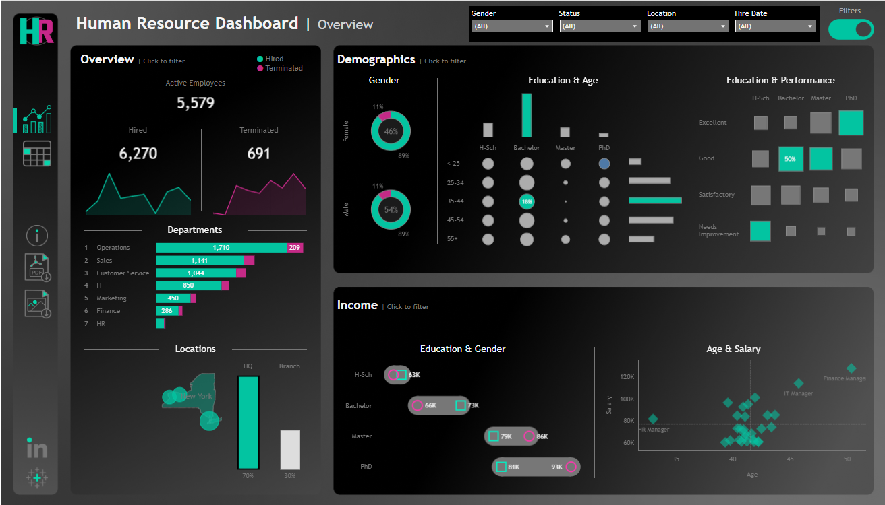
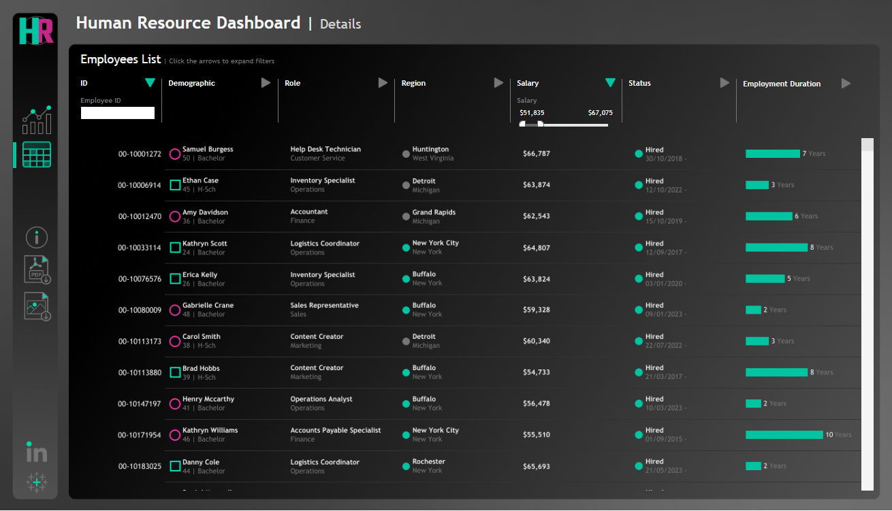

# 🧭 Human Resource Analytics Dashboard #

## Overview ##
The Human Resource Dashboard offers a comprehensive view of employee data, tracking hiring trends, demographics, performance, and compensation to help HR teams make data-driven workforce decisions efficiently.

### 📊  Dashboard Summary ###
This interactive Tableau dashboard provides insights into the organization’s workforce structure and trends. It consolidates HR metrics such as hiring, termination, education, performance, income, and demographics into one intuitive interface.

## 🎯 Key Insights ##

### 👥 Employee Overview ###

- Displays total active employees, hires, and terminations.
- Visualizes hiring and termination trends over time.

### 🏢 Department Analysis ###
- Shows employee distribution and turnover by department.
- Highlights departments with high recruitment or attrition rates.

### 🧬 Demographics ###
- Analyzes employee gender, age, and education level.
- Helps assess diversity and workforce balance.

### 🎓 Education & Performance ###
- Correlates employee performance with education level.
- Identifies top-performing educational backgrounds.

### 💰 Income Analysis ###
- Compares average salaries across education levels and genders.
- Reveals compensation equity and pay distribution trends.
  
### 📈 Age & Salary Correlation ###
- Plots age against salary to visualize experience-based pay trends.
- Highlights roles such as IT Manager and Finance Manager with higher compensation ranges.

### 🌍 Locations ###
- Displays employee distribution across HQ and branch offices.
- Provides a geographic overview of workforce allocation.

### ⚙️ Filters & Interactivity ###
The dashboard includes dynamic filters to refine insights by:
- Gender
- Employment Status (Hired / Terminated)
- Location
- Hire Date
These filters allow users to explore specific subsets of data in real time for deeper understanding.

### 🧠 Tools & Technologies ###
- Visualization Tool: Tableau
- Metrics Covered: Headcount, Turnover, Education, Performance, Salary, Location
- Design Style: Dark theme with teal and magenta highlights for modern readability

### 💡 Purpose ###
This project demonstrates how HR analytics can drive better workforce management by providing:
- Data-driven decision-making
- Workforce planning and forecasting
- Diversity and inclusion insights
- Salary benchmarking and equity analysis

## Details Dashboard ##
The Details Dashboard provides an in-depth view of individual employee data, complementing the main HR overview dashboard. It allows HR managers to explore specific employee information such as demographics, roles, salary, and employment duration.

### 🔍 Key Features ###
- Employee Directory: Interactive list of employees with quick search by ID.
- Role & Region Insights: Displays each employee’s job title and work location.
- Salary Analysis: Includes a dynamic salary range filter to analyze compensation distribution.
- Employment Duration: Visual bars represent each employee’s tenure within the company.
- Status Tracking: Clearly identifies active and terminated employees along with their hire dates.

### ⚙️ Filters & Interactivity ###
Users can filter by:
- Employee ID
- Salary Range
- Status (Hired / Terminated)
- Region
- Role
  
### 🎯 Purpose ###
This dashboard supports individual-level analysis, making it easier for HR teams to:
- Review compensation and performance consistency.
- Identify long-serving or recently hired employees.
- Analyze workforce distribution by role and region.

